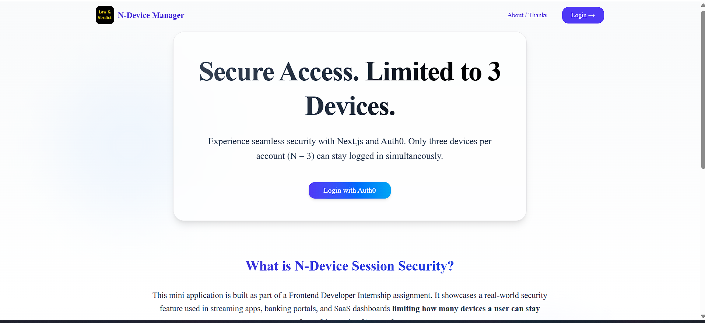
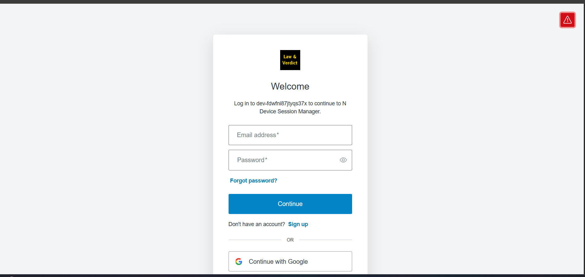
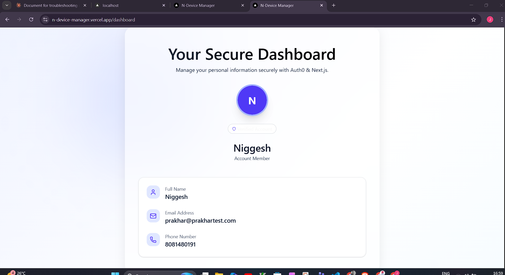
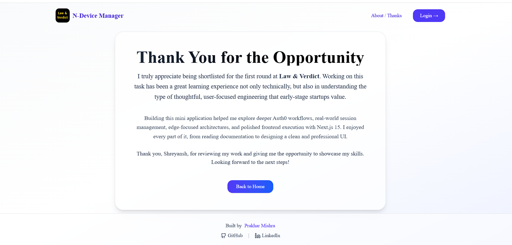

# N-Device Session Manager - Complete Documentation

## 📋 Table of Contents

1. [Project Overview](#project-overview)
2. [Setup Steps](#setup-steps)
3. [Architecture Design](#architecture-design)
4. [N-Device Concurrency System](#n-device-concurrency-system)
5. [Deployment Guide](#deployment-guide)
6. [Best Practices & Notes](#best-practices--notes)

---

## 🎯 Project Overview

This project demonstrates **N-device concurrent session management** (N=3) using modern web technologies. It's built as a frontend developer internship assignment showcasing:

- **Authentication**: Auth0 integration with Next.js 15 App Router
- **Session Management**: Redis-based device tracking
- **Security**: Enforce maximum device limit per user
- **UX**: Graceful force-logout experience
- **UI**: Professional, minimal design using TailwindCSS, shadcn/ui, and Framer Motion

### Key Features

- ✅ Only 3 devices allowed per user simultaneously
- ✅ 4th device triggers device selection modal
- ✅ Force-logout capability for existing devices
- ✅ Graceful logout notification for removed devices
- ✅ User profile completion (full name + phone)
- ✅ Persistent profile storage in Redis

---

## 📸 UI Screenshots

### Landing Page



### Signup Page



### Dashboard



### Active Device List


### Edit Profile Page


### Thanks Page



## 🚀 Setup Steps

### 1. Prerequisites

- Node.js 18+ installed
- Git installed
- Accounts created on:
  - [Auth0](https://auth0.com) (free tier)
  - [Upstash](https://upstash.com) (free tier)
  - [Vercel](https://vercel.com) (free tier)

### 2. Clone & Install

```bash
# Clone the repository
git clone <your-repo-url>
cd n-device-manager

# Install dependencies
npm install
```

### 3. Auth0 Configuration

#### Step 3.1: Create Auth0 Application

1. Go to [Auth0 Dashboard](https://manage.auth0.com)
2. Navigate to **Applications** → **Create Application**
3. Name: `N-Device Manager`
4. Type: **Regular Web Application**
5. Click **Create**

#### Step 3.2: Configure Application Settings

In your Auth0 application settings:

**Allowed Callback URLs:**

```
http://localhost:3000/api/auth/callback
https://your-domain.vercel.app/api/auth/callback
```

**Allowed Logout URLs:**

```
http://localhost:3000
https://your-domain.vercel.app
```

**Allowed Web Origins:**

```
http://localhost:3000
https://your-domain.vercel.app
```

**Save Changes**

#### Step 3.3: Note Your Credentials

Copy these values (you'll need them for `.env.local`):

- **Domain** (e.g., `dev-xxxxx.us.auth0.com`)
- **Client ID**
- **Client Secret**

### 4. Upstash Redis Setup

#### Step 4.1: Create Redis Database

1. Go to [Upstash Console](https://console.upstash.com)
2. Click **Create Database**
3. Name: `n-device-sessions`
4. Region: Choose closest to your target users
5. Click **Create**

#### Step 4.2: Copy Credentials

From your database dashboard, copy:

- **UPSTASH_REDIS_REST_URL**
- **UPSTASH_REDIS_REST_TOKEN**

### 5. Environment Variables

Create `.env.local` in project root:

```bash
# Auth0 Configuration
AUTH0_SECRET='<generate-with: openssl rand -hex 32>'
AUTH0_BASE_URL='http://localhost:3000'
AUTH0_ISSUER_BASE_URL='https://dev-xxxxx.us.auth0.com'
AUTH0_CLIENT_ID='your-auth0-client-id'
AUTH0_CLIENT_SECRET='your-auth0-client-secret'

# Upstash Redis
UPSTASH_REDIS_REST_URL='https://xxxxx.upstash.io'
UPSTASH_REDIS_REST_TOKEN='your-upstash-token'
```

**Generate AUTH0_SECRET:**

```bash
openssl rand -hex 32
```

### 6. Run Development Server

```bash
npm run dev
```

Visit `http://localhost:3000`

### 7. Project Structure

```
n-device-manager/
├── app/
│   ├── api/
│   │   ├── device/
│   │   │   ├── force-logout/route.ts   # Remove device from allowed list
│   │   │   ├── list/route.ts           # Get user's active devices
│   │   │   ├── register/route.ts       # Register new device
│   │   │   └── validate/route.ts       # Check if device is still allowed
│   │   └── profile/
│   │       └── complete/route.ts       # Save user profile to Redis
│   ├── complete-profile/
│   │   ├── page.tsx                    # Server component (redirect logic)
│   │   └── CompleteProfileClient.tsx   # Form UI
│   ├── dashboard/
│   │   ├── page.tsx                    # Server component (auth check)
│   │   ├── DashboardClient.tsx         # Client orchestrator
│   │   ├── DashboardUI.tsx             # Dashboard UI
│   │   └── DeviceRegisterClient.tsx    # Device limit modal
│   ├── logged-out/
│   │   └── page.tsx                    # Force-logout message
│   ├── thanks/
│   │   └── page.tsx                    # Thank you page
│   ├── layout.tsx                      # Root layout
│   ├── page.tsx                        # Homepage
│   └── globals.css                     # Global styles
├── components/
│   ├── ui/                             # shadcn/ui components
│   │   ├── avatar.tsx
│   │   ├── badge.tsx
│   │   ├── button.tsx
│   │   ├── card.tsx
│   │   └── dialog.tsx
│   ├── ActiveDevices.tsx               # Device list component
│   ├── Footer.tsx                      # Footer component
│   ├── Header.tsx                      # Navigation header
│   └── useDeviceValidation.ts          # Device validation hook
├── lib/
│   ├── auth0.ts                        # Auth0 client instance
│   └── redis.ts                        # Upstash Redis client
├── middleware.ts                       # Auth0 middleware
├── next.config.ts                      # Next.js configuration
├── package.json                        # Dependencies
├── tailwind.config.ts                  # Tailwind configuration
└── tsconfig.json                       # TypeScript configuration
```

---

## 🏗️ Architecture Design

### Client vs Server Components

#### Server Components (RSC)

- `app/dashboard/page.tsx` - Fetches user profile from Redis
- `app/complete-profile/page.tsx` - Checks if profile exists
- All API routes under `app/api/`

**Why?** Direct database access, better performance, no client bundle size

#### Client Components

- `DashboardClient.tsx` - Orchestrates device registration + validation
- `DashboardUI.tsx` - Renders dashboard UI with animations
- `DeviceRegisterClient.tsx` - Device limit modal logic
- `CompleteProfileClient.tsx` - Profile form with state
- `ActiveDevices.tsx` - Device list with force-logout actions
- `useDeviceValidation.ts` - Polling hook for device status

**Why?** Interactive features, localStorage access, state management

### Middleware Flow

```typescript
// middleware.ts
export async function middleware(req: NextRequest) {
  // 1. Auth0 SDK handles session cookies
  const response = await auth0.middleware(req);

  // 2. Check if user is authenticated
  const session = await auth0.getSession(req);

  // 3. Redirect unauthenticated users (except /auth routes)
  if (!session && !req.nextUrl.pathname.startsWith("/auth")) {
    return NextResponse.redirect(new URL("/auth/login", req.url));
  }

  return response;
}
```

**Flow:**

1. Auth0 SDK automatically creates `/api/auth/login`, `/api/auth/logout`, `/api/auth/callback`
2. Middleware runs on every request (except static files)
3. Protected pages require valid Auth0 session
4. Invalid sessions redirect to `/auth/login`

### Redis Data Models

#### 1. Device Sessions

```
Key: devices:{userId}
Type: Hash
Fields: {
  [deviceId]: JSON.stringify({
    deviceId: string,
    ua: string (user agent),
    ip: string,
    ts: string (ISO timestamp),
    label: string | null
  })
}
```

**Why Hash?** Efficient field-level operations (add/remove individual devices)

#### 2. User Profiles

```
Key: profile:{userId}
Type: Hash
Fields: {
  fullName: string,
  phone: string
}
```

**Why Hash?** Simple key-value storage for profile data

---

## 🔐 N-Device Concurrency System

### How It Works: Step-by-Step

#### 1. User Logs In (First Time)

```
User clicks "Login"
  → Redirects to Auth0
  → Auth0 authenticates user
  → Redirects to /api/auth/callback
  → Auth0 SDK creates session cookie
  → Middleware allows access
  → User lands on /dashboard
```

#### 2. Dashboard Page Load

**Server Side (`page.tsx`):**

```typescript
// Check if profile exists
const profile = await redis.hgetall(`profile:${userId}`);

if (!profile?.fullName || !profile?.phone) {
  redirect("/complete-profile"); // First-time users
}
```

**Client Side (`DashboardClient.tsx`):**

```typescript
// Trigger device registration
<DeviceRegisterClient onRegistered={() => setDeviceRegistered(true)} />
```

#### 3. Device Registration

**Flow in `DeviceRegisterClient.tsx`:**

```typescript
useEffect(() => {
  // 1. Get or create device ID
  let deviceId = localStorage.getItem("deviceId");
  if (!deviceId) {
    deviceId = crypto.randomUUID();
    localStorage.setItem("deviceId", deviceId);
  }

  // 2. Register with backend
  const res = await fetch("/api/device/register", {
    method: "POST",
    body: JSON.stringify({ deviceId }),
  });

  const data = await res.json();

  // 3. Check if limit exceeded
  if (data.exceeded) {
    setLimitDevices(data.devices); // Show modal
    return;
  }

  // 4. Registration successful
  onRegistered(); // Enable validation polling
}, []);
```

**Backend (`/api/device/register`):**

```typescript
// 1. Fetch existing devices
const raw = await redis.hgetall(`devices:${userId}`);
const devices = Object.values(raw).map(JSON.parse);
const count = devices.length;

// 2. Check if device already exists
const isExisting = !!raw[deviceId];

// 3. Enforce limit (3 devices max)
if (count >= 3 && !isExisting) {
  return NextResponse.json({
    exceeded: true,
    devices, // Return list for modal
  });
}

// 4. Register device
await redis.hset(`devices:${userId}`, {
  [deviceId]: JSON.stringify({
    deviceId,
    ua: req.headers.get("user-agent"),
    ip: req.headers.get("x-forwarded-for"),
    ts: new Date().toISOString(),
  }),
});
```

#### 4. Device Limit Modal (4th Device)

When `exceeded: true`:

**UI Shows:**

- List of 3 existing devices
- "Force Logout" button for each (except current)
- "Cancel Login" button

**User Clicks "Force Logout":**

```typescript
// Frontend
await fetch("/api/device/force-logout", {
  method: "POST",
  body: JSON.stringify({ deviceId: targetDeviceId }),
});

window.location.reload(); // Re-trigger registration
```

```typescript
// Backend (/api/device/force-logout)
await redis.hdel(`devices:${userId}`, deviceId);
// Removed device will fail validation on next check
```

#### 5. Device Validation (Continuous)

**After successful registration:**

```typescript
// useDeviceValidation.ts
useEffect(() => {
  if (!deviceRegistered) return;

  async function validate() {
    const deviceId = localStorage.getItem("deviceId");

    const res = await fetch("/api/device/validate", {
      headers: { "x-device-id": deviceId },
    });

    if (res.status === 401) {
      const data = await res.json();
      if (data.reason === "FORCED_LOGOUT") {
        window.location.href = "/logged-out?forced=1";
      }
    }
  }

  validate(); // Run once after registration
}, [deviceRegistered]);
```

**Backend (`/api/device/validate`):**

```typescript
const raw = await redis.hgetall(`devices:${userId}`);

// Device not in allowed list = force logged out
if (!raw || !raw[deviceId]) {
  return NextResponse.json(
    {
      valid: false,
      enforcedLogout: true,
      reason: "FORCED_LOGOUT",
    },
    { status: 401 }
  );
}
```

#### 6. Graceful Force-Logout Experience

**Device A (active):** Clicks "Force Logout" on Device B
**Device B (victim):** Next validation check fails
→ Redirects to `/logged-out?forced=1`
→ Shows friendly message explaining removal

---

## 🚀 Deployment Guide

### 1. Vercel Deployment

#### Step 1: Push to GitHub

```bash
git add .
git commit -m "Initial commit"
git push origin main
```

#### Step 2: Import to Vercel

1. Go to [Vercel Dashboard](https://vercel.com/dashboard)
2. Click **Add New** → **Project**
3. Import your GitHub repository
4. Vercel auto-detects Next.js

#### Step 3: Configure Environment Variables

In Vercel project settings → **Environment Variables**, add:

```
AUTH0_SECRET=<your-secret>
AUTH0_BASE_URL=https://your-project.vercel.app
AUTH0_ISSUER_BASE_URL=https://dev-xxxxx.us.auth0.com
AUTH0_CLIENT_ID=<your-client-id>
AUTH0_CLIENT_SECRET=<your-client-secret>
UPSTASH_REDIS_REST_URL=<your-upstash-url>
UPSTASH_REDIS_REST_TOKEN=<your-upstash-token>
```

**Important:** Update `AUTH0_BASE_URL` to your Vercel domain

#### Step 4: Deploy

Click **Deploy** → Wait for build to complete

#### Step 5: Update Auth0 URLs

Go back to Auth0 Application Settings and add:

**Allowed Callback URLs:**

```
https://your-project.vercel.app/api/auth/callback
```

**Allowed Logout URLs:**

```
https://your-project.vercel.app
```

**Allowed Web Origins:**

```
https://your-project.vercel.app
```

### 2. Custom Domain (Optional)

1. Vercel Dashboard → Your Project → **Settings** → **Domains**
2. Add your custom domain
3. Update Auth0 URLs to include new domain

---

## 📝 Best Practices & Notes

### Security Considerations

✅ **Never expose secrets** in client components
✅ **Use environment variables** for all credentials
✅ **Validate sessions server-side** (middleware)
✅ **Sanitize user inputs** (profile completion)
✅ **Use HTTPS in production** (enforced by Vercel)

### Performance Optimizations

✅ **Server Components by default** (RSC pattern)
✅ **Client Components only when needed** (interactivity)
✅ **Redis Hash operations** (O(1) lookups)
✅ **Minimal JavaScript bundle** (Tailwind JIT)

### Code Quality

✅ **TypeScript strict mode** (type safety)
✅ **Consistent naming conventions** (camelCase, PascalCase)
✅ **No console.log in production** (removed)
✅ **Error boundaries** (graceful failures)
✅ **Proper loading states** (better UX)

### Known Limitations

⚠️ **Device detection:** Based on localStorage (not hardware fingerprinting)
⚠️ **Polling frequency:** Validation runs once after registration (not continuous)
⚠️ **Concurrent logins:** 4th device must actively force logout (not automatic)

### Future Improvements

💡 **WebSocket polling:** Real-time device removal notifications
💡 **Hardware fingerprinting:** Canvas + WebGL + Audio API
💡 **Device labels:** Let users name devices ("MacBook Pro", "iPhone")
💡 **Login history:** Track all login attempts with timestamps
💡 **2FA support:** Add two-factor authentication
💡 **Session expiry:** Auto-logout after N hours of inactivity

---

## 🎓 Learning Outcomes

This project demonstrates proficiency in:

1. **Modern Next.js 15** - App Router, Server Components, Middleware
2. **Authentication** - Auth0 integration, session management
3. **Database Operations** - Redis Hash operations, data modeling
4. **State Management** - Client state, localStorage, React hooks
5. **UI/UX Design** - Professional design with Tailwind, Framer Motion
6. **TypeScript** - Type-safe API responses, props, state
7. **Deployment** - Vercel, environment configuration
8. **Architecture** - Clean code, separation of concerns, scalability

---

## 📞 Support

For questions or issues:

- **GitHub**: [mprakhar07](https://github.com/mprakhar07)
- **LinkedIn**: [mprakhar07](https://linkedin.com/in/mprakhar07)

Built with ❤️ for Law & Verdict Frontend Internship Assignment
